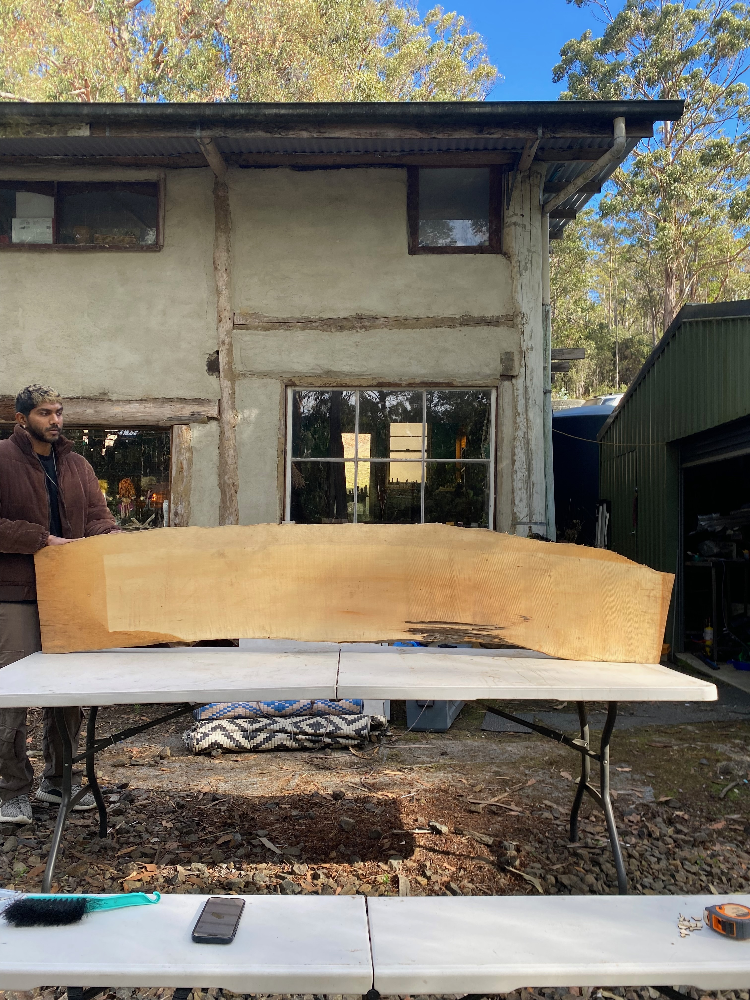

# Vedya Design System

A generative design system for creating and fabricating geometric patterns and modular structures with computational methods in Fusion 360.

## Overview

**Project:** Mandala Sculpture for Australia Bush Festival  
**Materials:** Wood (Huon Pine), Modelling Paste, 3D Print Materials, CNC Router Materials  
**Dimensions:** Full Installation 2m x 2m; Prototypes vary in size


## Visual Examples

### Fabrication Process



## Algorithm & Design Approach

The Vedya system uses a hierarchical composition-based algorithm to generate complex geometric designs:

### Core Algorithm

```
FUNCTION GenerateVedyaDesign(designType, seed, fabricationType, fabricationMode):
    // Initialize design context
    context = CreateDesignContext(designType, seed, fabricationType, fabricationMode)
    
    // Generate base geometry based on selected design template
    component = GenerateShireDesign(context.rootComponent)
    
    // Apply post-processing based on fabrication mode
    IF fabricationMode == "slicer":
        SliceComponent(component, layerDepth, layerCount)
    ELSE IF fabricationMode == "aggregator":
        AggregateComponents(component)
    
    RETURN component
```

### Composition System

The design generation uses a composition-based approach:

1. **Primitive Shapes**: Basic geometric elements (circles, rectangles)
2. **Modifiers**: Operations applied to shapes (extrude, boolean, array)
3. **Composition Layers**: Collections of shapes with modifiers
4. **Full Composition**: Hierarchical arrangement of layers

Example of the Shire design generation:

```
FUNCTION GenerateShireDesign(rootComponent):
    // Create background layer
    background = CreateBackgroundLayer(rootComponent)
    
    // Create border
    border = CreateBorder(rootComponent)
    
    // Create seed of life patterns (layered)
    seedOfLifeLayer0 = CreateSeedOfLifeLayer0(rootComponent)
    seedOfLifeLayer1 = CreateSeedOfLifeLayer1(rootComponent)
    seedOfLifeLayer2 = CreateSeedOfLifeLayer2(rootComponent)
    
    // Create core component
    core = CreateComponentCore(rootComponent)
    
    // Create torus astroid pattern
    torusAstroid = CreateTorusAstroid(rootComponent)
    
    // Apply middle cut
    ApplyMiddleCut(rootComponent)
    
    // Apply terrain cut (optional)
    ApplyTerrainCut(rootComponent)
    
    RETURN rootComponent
```

### Key Geometric Algorithms


#### Astroid Curve Algorithm

An astroid is a hypocycloid with four cusps. In the Vedya system, we implement a generalized version that allows for variable cusps (n-cusps) and parametric control. The algorithm to generate points along an astroid curve is:

```
FUNCTION GenerateAstroidPoints(centerX, centerY, radius, n, numPoints):
    points = []
    
    // Generate points along the astroid curve
    FOR i = 0 TO numPoints-1:
        t = i * (2π/numPoints)
        x = centerX + radius * cos(t)^n
        y = centerY + radius * sin(t)^n
        points.ADD((x, y))
    
    RETURN points
```


Where:
- `n` is the power parameter that controls the shape (n=3 for classic astroid)
- `numPoints` determines the resolution of the curve
- `radius` controls the size of the astroid

The Torus Astroid in the Vedya system combines this curve with circular elements to create complex patterns with:
- Inner and outer boundaries
- Stroke weight variations
- Radial symmetry
- Depth variations when extruded to 3D

#### Seed of Life Algorithm

The Seed of Life is a sacred geometry pattern formed by seven overlapping circles of the same size. The algorithm to generate this pattern follows these steps:

```
FUNCTION GenerateSeedOfLife(centerX, centerY, radius):
    // Create the central circle
    circles = [Circle(centerX, centerY, radius)]
    
    // Create six circles around the central circle
    FOR i = 0 TO 5:
        angle = i * (2π/6)
        newCenterX = centerX + radius * cos(angle)
        newCenterY = centerY + radius * sin(angle)
        circles.ADD(Circle(newCenterX, newCenterY, radius))
    
    RETURN circles
```


The Seed of Life pattern has deep historical significance in sacred geometry, appearing in ancient cultures worldwide. In the Vedya system, this pattern serves as a foundational element for creating complex mandala designs. The implementation allows for:

- Variable scaling of the pattern
- Layering with different radii
- Combination with other geometric elements through boolean operations
- Depth extrusion to create 3D forms

### Geometric Operations

The system uses several key geometric operations:

1. **Boolean Operations**: Union, difference, and intersection of shapes
2. **Array Patterns**: Radial, linear, and grid arrangements of elements
3. **Extrusion**: Converting 2D sketches to 3D forms
4. **Coordinate Transformations**: Mapping between coordinate systems (cartesian, cylindrical, spherical)

## Architecture

The Vedya system follows a pattern → transform → render workflow:
- **Pattern:** Generate base geometric patterns
- **Transform:** Apply coordinate transformations (cartesian, cylindrical, spherical)
- **Render:** Output to various formats (STL, OBJ, PNG)

## Setup & Installation

### Fusion 360 Integration

1. Configure environment:
   ```
   # In .env file
   PYTHONPATH=/path/to/fusion360/API/Python/libs
   LOGFILEPATH=/path/to/logfile.txt
   ```

2. Run the script:
   - Open Fusion 360
   - Open the script in Script Editor
   - Run the script

### Python Development

1. Setup environment:
   ```
   poetry shell
   poetry install
   ```

2. Available commands:
   ```
   # Transform coordinates
   vedya transform input.txt --target cylinder --resolution 0.1 --length 10 --height 4 --radius 1 --output output.txt
   
   # Render output
   vedya render output.txt --output output.stl --color grayscale
   
   # Run examples
   vedya example output_path
   ```

## Fabrication Methods

### 3D Printing
- **Printers:** Bambu Labs X1C/P1S (256mm³ build volume)
- **Materials:** PLA, PETG, TPU, ABS, ASA, PVA, PET
- **Examples:**
  - [Print 1 with Kailash Terrain](public/3d-printer-prototypes/print-1/3d-vedya-print-with-kailash-0.75;1;8.mp4)
  - [Print 2 Standard](public/3d-printer-prototypes/print-2/3d-vedya-print-1;1;8.mp4)
  - [Detailed Print Process](src/public/videos/detailed-print-process.mov)

### CNC Milling
- Used for wood components (Huon Pine)
- [Laser Prototype Slice](public/laser-prototypes/vedya-laser-1/slice-body-8/slice-body-8.stl)
- [CNC Toolpath Simulation](src/public/videos/cnc-toolpath-simulation.mov)

### Terrain Models
- [Low Resolution Kailash](public/low-res-kailash/low-res-kailash.stl)
- [Medium Resolution Kailash](public/mid-res-kailash/mid-res-kailash.stl)
- [Terrain Integration Process](public/terrain-integration.png)

## Project Components

### Shire
Mandala design for Australia Bush Festival, collaboration between Jeevan Pillay and Adam Brown, Gemma & team at Tasmania.
- Implementation: [Shire Design](src/core/fabrication/design/shire/index.py)
- [Installation Photos](public/shire-site.jpeg)

## Documentation

Additional documentation available in subdirectories:
- [Core Library Documentation](src/lib/README.md)
- [Print 1 Notes](public/3d-printer-prototypes/print-1/README.md)
- [Print 2 Notes](public/3d-printer-prototypes/print-2/README.md)

## Troubleshooting

- [Fixing VSCode x Python Code Hints](https://forums.autodesk.com/t5/fusion-api-and-scripts/code-hints-in-visual-studio-code-howto/td-p/9151250)
- [BambuStudio Filament Process](public/3d-printer-prototypes/README.md)
